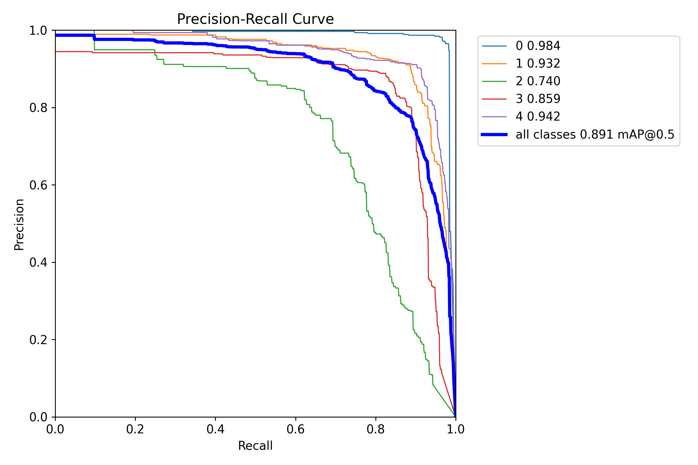
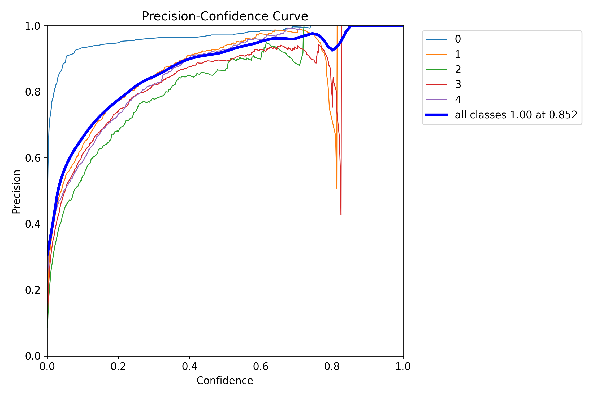
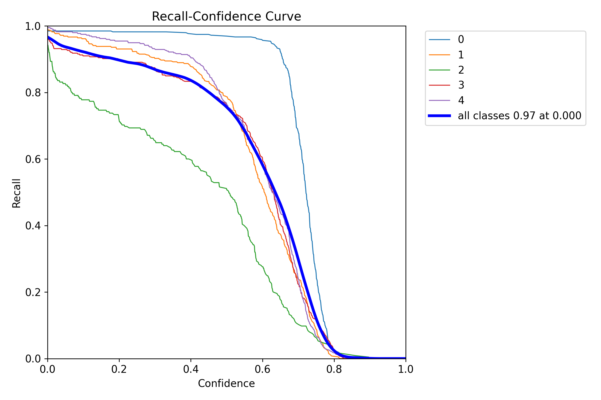
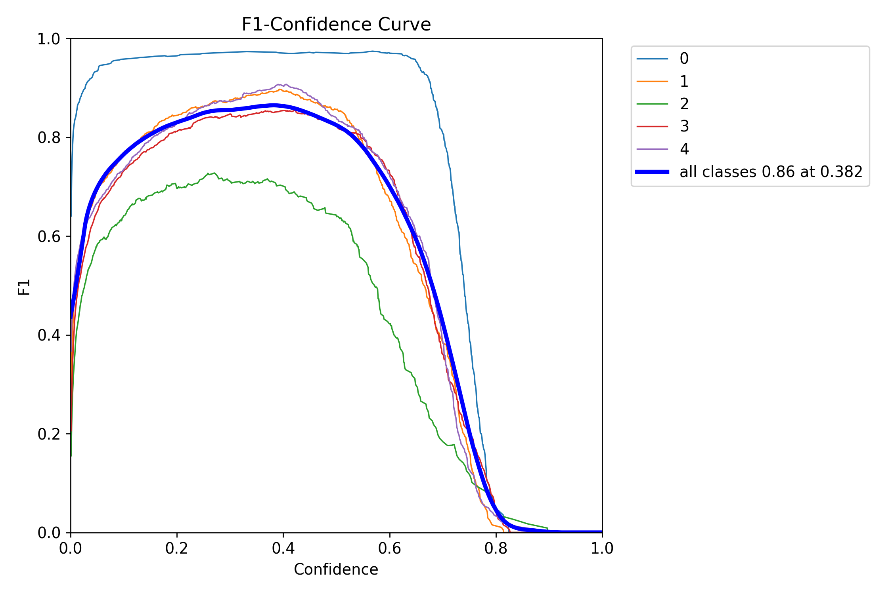

# X-Ray Luggage and Suitcase Detection System

Welcome to the **X-Ray Luggage and Suitcase Detection System** repository. This project aims to build an intelligent system for detecting illegal and prohibited items within luggage and suitcases using X-ray images, leveraging the YOLOv8 object detection model. This solution is designed to enhance security screening in airports, customs, and any other facility using X-ray scans for baggage inspection.

## Project Overview

In many high-security areas, it is crucial to detect unauthorized items within luggage efficiently. This system utilizes **YOLOv8**, a state-of-the-art object detection model, to accurately detect illegal and prohibited items in X-ray images. With our dataset of 6,000 X-ray images, we have trained the YOLOv8 model to recognize potential threats and ensure that security screening is both efficient and effective.

### Key Features
- **High Accuracy**: Powered by the YOLOv8 model, known for its accuracy in object detection tasks.
- **Real-Time Detection**: Capable of quickly processing X-ray images to identify illegal items in real-time.
- **Customizable**: Easily adaptable for detecting new types of prohibited items with additional training data.

## Dataset

We used a custom dataset comprising **6,000 X-ray images** of various suitcases and luggage. The dataset includes images with various configurations and placements of objects, allowing the model to generalize well across different scenarios.

### Classes Detected

The system is trained to detect:
- Weapons
- Explosives
- Knives
- Liquids exceeding permissible limits
- Any other items that are prohibited in high-security zones

## Model Architecture

Our model is based on **YOLOv8 (You Only Look Once, version 8)**, which is an advanced object detection framework well-suited for complex image datasets. YOLOv8 provides:
- **Speed**: Processes images in real-time.
- **Precision**: High accuracy in detecting and localizing objects.
- **Efficiency**: Optimized for both CPU and GPU, making it versatile across devices.

## Results

The YOLOv8 model was trained and evaluated on our X-ray luggage dataset, achieving high precision and recall rates for the detection of illegal items. The results show promise for practical application in real-world security systems.

### Performance Metrics
| Metric    | Score |
|-----------|-------|
| Precision | 85.2% |
| Recall    | 74.0% |
| F1-Score  | 86%   |
| mAP@0.5   | 89.1% |





*Note: Please refer to the [model training logs](#) for detailed metrics and model evaluation.*

## Installation

To set up the environment and get started with this project, follow these steps:

1. **Clone the Repository**
    ```bash
    git clone https://github.com/your-username/xray-luggage-detection.git
    cd xray-luggage-detection
    ```

2. **Install Dependencies**
    ```bash
    pip install -r requirements.txt
    ```

3. **Download Trained Model Weights**
   - [YOLOv8 Weights](#) - Download the pre-trained weights for this model and place them in the `weights` folder.

## Usage

1. **Run Inference**
   ```bash
   python detect.py --source path/to/xray/image.jpg --weights weights/yolov8_weights.pth
